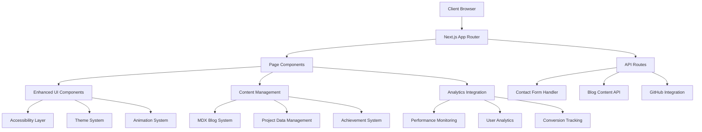

# Portfolio Enhancement Design Document

## Overview

This design document outlines the architecture and implementation approach for transforming the existing Next.js portfolio into a professional, industry-standard showcase. The design maintains the current modern aesthetic while adding substantial functionality for content management, user engagement, and professional credibility.

The enhancement follows a modular approach, allowing incremental implementation while maintaining the existing codebase structure. Key focus areas include real project showcasing, professional credibility features, enhanced UX/accessibility, content management, and performance optimization.

## Architecture

### High-Level Architecture



### Technology Stack Enhancement

**Current Stack (Maintained):**
- Next.js 15 with App Router
- React 19
- TypeScript
- Tailwind CSS 4
- Framer Motion

**New Additions:**
- MDX for blog content management
- React Hook Form for enhanced forms
- Zod for schema validation
- Resend for email handling
- Vercel Analytics for performance tracking
- React Aria for accessibility
- Next-themes for theme management
- Sharp for image optimization

## Components and Interfaces

### 1. Enhanced Project Showcase System

**ProjectShowcase Component Architecture:**

```typescript
interface RealProject {
  id: string;
  title: string;
  description: string;
  longDescription: string;
  problemStatement: string;
  solutionApproach: string;
  technicalChallenges: string[];
  technologies: TechnologyDetail[];
  metrics: ProjectMetric[];
  githubUrl: string;
  liveUrl?: string;
  images: ProjectImage[];
  caseStudyUrl?: string;
  featured: boolean;
  status: 'completed' | 'in-progress' | 'archived';
  startDate: Date;
  endDate?: Date;
  collaborators?: Collaborator[];
}

interface TechnologyDetail {
  name: string;
  version?: string;
  purpose: string;
  proficiencyLevel: 1 | 2 | 3 | 4 | 5;
}

interface ProjectMetric {
  label: string;
  value: string;
  description: string;
  type: 'performance' | 'business' | 'technical' | 'user';
}
```

**Key Features:**
- Detailed case study modals with problem/solution narrative
- Interactive technology stack with proficiency indicators
- Real metrics and impact measurements
- GitHub repository integration with live stats
- Image galleries with optimized loading
- Filtering and search capabilities

### 2. Professional Credibility System

**Achievement & Testimonial Components:**

```typescript
interface Achievement {
  id: string;
  title: string;
  issuer: string;
  date: Date;
  credentialId?: string;
  credentialUrl?: string;
  type: 'certification' | 'award' | 'recognition' | 'publication';
  description: string;
  skills: string[];
  image?: string;
}

interface Testimonial {
  id: string;
  author: string;
  role: string;
  company: string;
  content: string;
  relationship: 'colleague' | 'manager' | 'client' | 'mentor';
  linkedinUrl?: string;
  avatar?: string;
  date: Date;
  featured: boolean;
}
```

**Implementation Features:**
- Verification badges for certifications
- LinkedIn integration for testimonial verification
- Achievement timeline with visual indicators
- Professional summary with quantified experience
- Speaking engagements and publication showcase

### 3. Enhanced User Experience Layer

**Accessibility & Theme System:**

```typescript
interface ThemeConfig {
  mode: 'light' | 'dark' | 'system';
  accentColor: string;
  reducedMotion: boolean;
  highContrast: boolean;
  fontSize: 'small' | 'medium' | 'large';
}

interface AccessibilityFeatures {
  keyboardNavigation: boolean;
  screenReaderOptimized: boolean;
  focusManagement: boolean;
  ariaLabels: boolean;
  semanticHTML: boolean;
}
```

**Key Components:**
- Theme toggle with system preference detection
- Keyboard navigation with visible focus indicators
- Screen reader optimized content structure
- Mobile-first responsive design
- Touch-optimized interactions
- Reduced motion support

### 4. Content Management System

**Blog & Article System:**

```typescript
interface BlogPost {
  slug: string;
  title: string;
  excerpt: string;
  content: string; // MDX content
  publishedAt: Date;
  updatedAt?: Date;
  tags: string[];
  category: string;
  readingTime: number;
  featured: boolean;
  seoTitle?: string;
  seoDescription?: string;
  ogImage?: string;
  relatedPosts?: string[];
}

interface ContentMetadata {
  totalPosts: number;
  categories: string[];
  popularTags: string[];
  recentPosts: BlogPost[];
  featuredPosts: BlogPost[];
}
```

**Features:**
- MDX-based content with syntax highlighting
- Tag-based categorization and filtering
- Reading time estimation
- Related articles suggestions
- Social media sharing integration
- SEO optimization for each post

### 5. Contact & Lead Generation System

**Enhanced Contact Components:**

```typescript
interface ContactForm {
  name: string;
  email: string;
  company?: string;
  projectType: 'freelance' | 'full-time' | 'consultation' | 'collaboration';
  budget?: string;
  timeline?: string;
  message: string;
  source: string;
}

interface AvailabilityStatus {
  available: boolean;
  nextAvailable?: Date;
  preferredContactMethod: 'email' | 'linkedin' | 'calendar';
  responseTime: string;
  currentProjects: number;
}
```

**Implementation:**
- Multi-step contact form with validation
- Email notification system using Resend
- Calendar integration for scheduling
- Availability status display
- Project inquiry categorization
- Lead tracking and analytics

## Data Models

### Project Data Structure

```typescript
// Real project data replacing placeholder content
const realProjects: RealProject[] = [
  {
    id: 'portfolio-website',
    title: 'Personal Portfolio Website',
    description: 'Modern, responsive portfolio built with Next.js 15 and advanced animations',
    problemStatement: 'Need for professional online presence to showcase skills and attract opportunities',
    solutionApproach: 'Built with modern React ecosystem focusing on performance and user experience',
    technologies: [
      { name: 'Next.js', version: '15.5.3', purpose: 'Full-stack framework', proficiencyLevel: 4 },
      { name: 'TypeScript', purpose: 'Type safety and developer experience', proficiencyLevel: 4 },
      { name: 'Tailwind CSS', version: '4.0', purpose: 'Utility-first styling', proficiencyLevel: 5 },
      { name: 'Framer Motion', purpose: 'Advanced animations', proficiencyLevel: 3 }
    ],
    metrics: [
      { label: 'Lighthouse Performance', value: '95+', description: 'Optimized loading and rendering', type: 'performance' },
      { label: 'Bundle Size', value: '<200KB', description: 'Optimized JavaScript bundle', type: 'technical' }
    ],
    githubUrl: 'https://github.com/VAIBHAVSING/portfolio',
    featured: true,
    status: 'completed'
  }
  // Additional real projects to be added
];
```

### User Interaction Tracking

```typescript
interface AnalyticsEvent {
  event: string;
  properties: {
    section?: string;
    project?: string;
    duration?: number;
    device?: string;
    referrer?: string;
  };
  timestamp: Date;
  sessionId: string;
}

interface ConversionMetrics {
  contactFormSubmissions: number;
  projectViewDuration: number;
  mostViewedProjects: string[];
  bounceRate: number;
  averageSessionDuration: number;
}
```

## Error Handling

### Client-Side Error Boundaries

```typescript
interface ErrorBoundaryState {
  hasError: boolean;
  error?: Error;
  errorInfo?: ErrorInfo;
}

// Implement error boundaries for:
// - Project loading failures
// - Contact form submission errors
// - Blog content loading issues
// - GitHub API failures
// - Image loading fallbacks
```

### API Error Handling

```typescript
interface APIResponse<T> {
  success: boolean;
  data?: T;
  error?: {
    code: string;
    message: string;
    details?: any;
  };
}

// Standardized error responses for:
// - Contact form submissions
// - Blog content fetching
// - GitHub integration
// - Analytics tracking
```

## Testing Strategy

### Component Testing
- Unit tests for all new components using Jest and React Testing Library
- Accessibility testing with jest-axe
- Visual regression testing for critical components
- Performance testing for animation-heavy components

### Integration Testing
- Contact form end-to-end testing
- GitHub integration testing
- Blog content loading and rendering
- Theme switching functionality
- Mobile responsiveness testing

### Performance Testing
- Lighthouse CI integration
- Bundle size monitoring
- Core Web Vitals tracking
- Image optimization verification
- Animation performance profiling

### Accessibility Testing
- Automated accessibility testing with axe-core
- Keyboard navigation testing
- Screen reader compatibility testing
- Color contrast validation
- Focus management verification

## SEO Optimization Strategy

### Technical SEO
- Comprehensive meta tags for all pages
- Structured data markup (JSON-LD) for professional information
- XML sitemap generation
- Robots.txt optimization
- Canonical URL management

### Content SEO
- Optimized page titles and descriptions
- Header tag hierarchy (H1-H6)
- Alt text for all images
- Internal linking strategy
- Blog content optimization for technical keywords

### Performance SEO
- Core Web Vitals optimization
- Image optimization with next/image
- Font optimization and preloading
- Critical CSS inlining
- JavaScript bundle optimization

## Implementation Phases

### Phase 1: Foundation Enhancement
- Theme system implementation
- Accessibility improvements
- Basic analytics integration
- Contact form enhancement

### Phase 2: Content Management
- Real project data integration
- Blog system implementation
- Achievement showcase
- Testimonial system

### Phase 3: Advanced Features
- Interactive project demos
- Advanced filtering and search
- Performance optimization
- SEO enhancements

### Phase 4: Analytics & Optimization
- Comprehensive analytics implementation
- A/B testing setup
- Conversion optimization
- Performance monitoring

This design provides a comprehensive roadmap for transforming the portfolio into a professional, industry-standard showcase while maintaining the existing modern aesthetic and technical foundation.